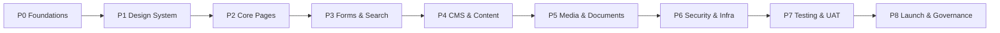

# Implementation Plan & Task Backlog — Accessible Website (Section 508 / WCAG 2.1 AA)

**Role:** System Architect
**Companion docs:** [README.md](README.md) · [Requirementdoc.md](Requirementdoc.md) · [Agent Skill](.github/skills/508-accessibility/SKILL.md)

This plan sequences the work into phases, defines exit criteria per phase, and lists a trackable task backlog mapped to requirement IDs. **Accessibility is a gate at every phase**, not a final step.

---

## 1. Delivery principles

- **Shift-left accessibility:** automated a11y checks run on every pull request.
- **Design system first:** build audited, reusable accessible components before pages.
- **Traceability:** every task maps to a requirement ID (`FR-*`, `A11Y-*`, `NFR-*`).
- **Strict standards:** semantic HTML, progressive enhancement, OWASP-secure I/O, documented component contracts.
- **Definition of Done** (see [Agent Skill](.github/skills/508-accessibility/SKILL.md)) applies to every task.

## 2. Phase roadmap

### Phase 0 — Foundations & environment
**Goal:** repos, pipeline, and accessibility tooling in place before feature work.
- Exit criteria: CI runs lint + unit + **axe/Pa11y/Lighthouse** on every PR; environments provisioned.

### Phase 1 — Accessible design system
**Goal:** audited component library (tokens, buttons, links, forms, modals, tabs, accordions, nav).
- Exit criteria: each component ships keyboard + SR support, contrast-compliant tokens, tests, and a documented accessibility contract.

### Phase 2 — Core pages & navigation
**Goal:** homepage, content pages, global nav, skip links, landmarks, heading structure.
- Exit criteria: FR-STR-1/2 met; keyboard + SR verified; W3C valid.

### Phase 3 — Forms & search
**Goal:** contact form, predictive search, accessible errors, non-visual CAPTCHA.
- Exit criteria: FR-STR-3/4, FR-FORM-1..4 met; live-region announcements verified.

### Phase 4 — CMS & content management
**Goal:** role-based CMS with accessible authoring; enforced alt/heading/metadata at publish.
- Exit criteria: FR-CMS-1/2, FR-ROLE-1/2 met; authoring UI itself accessible.

### Phase 5 — Media & documents
**Goal:** captioned video, audio transcripts, tagged accessible PDFs, document library.
- Exit criteria: FR-STR-5, A11Y-P-1/2 met; document a11y checks pass.

### Phase 6 — Security & infrastructure
**Goal:** HTTPS/HSTS, OWASP-aligned validation, RBAC, CDN, load balancing, monitoring.
- Exit criteria: NFR-SEC-*, NFR-PERF-1, NFR-SCALE-1, NFR-REL-1 met.

### Phase 7 — Testing & UAT
**Goal:** full automated + manual a11y suite; cross-browser; UAT with users with disabilities.
- Exit criteria: 0 critical/serious a11y issues; UAT feedback resolved.

### Phase 8 — Launch & governance
**Goal:** production deploy, accessibility statement, post-launch audit, ongoing governance.
- Exit criteria: statement published; monitoring + quarterly audit cadence active.

## 3. Task backlog

> Status legend: ☐ not started · ◔ in progress · ☑ done. Update as work proceeds.

### Phase 0 — Foundations
| # | Task | Maps to | Status |
| --- | --- | --- | --- |
| 0.1 | Initialize Git repo, branching strategy, PR templates | NFR-MAINT-1 | ☑ |
| 0.2 | Configure HTML/CSS/JS linters + `jsx-a11y` (or equivalent) | Coding standards | ☑ |
| 0.3 | Add axe-core, Pa11y, Lighthouse CI to pipeline | 10.1 | ☑ |
| 0.4 | Provision dev/staging/prod; HTTPS + HSTS baseline | 6.4, NFR-SEC-1 | ☑ |
| 0.5 | Wire unit/integration + Playwright E2E scaffolding | 10.2 | ☑ |

### Phase 1 — Design system
| # | Task | Maps to | Status |
| --- | --- | --- | --- |
| 1.1 | Define accessible design tokens (contrast-checked, reduced-motion) | A11Y-P-4, A11Y-O-3 | ☐ |
| 1.2 | Build Button/Link with correct roles + focus states | A11Y-O-5 | ☐ |
| 1.3 | Build Form controls (input, select, checkbox, radio, fieldset) | FR-FORM-1..3 | ☐ |
| 1.4 | Build Modal/Dialog (focus trap, Esc, restore focus) | A11Y-O-1, A11Y-R-1 | ☐ |
| 1.5 | Build Tabs/Accordion/Combobox per WAI-ARIA APG | A11Y-R-1 | ☐ |
| 1.6 | Build Nav + skip link + landmarks | A11Y-O-4 | ☐ |
| 1.7 | Document each component's a11y contract + tests | Coding standards | ☐ |

### Phase 2 — Core pages
| # | Task | Maps to | Status |
| --- | --- | --- | --- |
| 2.1 | Homepage: hero, quick links, search entry, landmarks | FR-STR-1 | ☐ |
| 2.2 | Content page template: headings, lists, data tables | FR-STR-2, A11Y-P-3 | ☐ |
| 2.3 | Global header/footer/nav with logical tab order | A11Y-O-4 | ☐ |
| 2.4 | Responsive layout + 400% zoom/reflow support | 6.1, NFR-A11Y-1 | ☐ |

### Phase 3 — Forms & search
| # | Task | Maps to | Status |
| --- | --- | --- | --- |
| 3.1 | Contact form with accessible validation + error summary | FR-STR-4, FR-FORM-2 | ☐ |
| 3.2 | Non-visual CAPTCHA alternative | FR-FORM-4 | ☐ |
| 3.3 | Predictive search (combobox pattern, live-region results) | FR-STR-3, A11Y-R-3 | ☐ |
| 3.4 | Server-side validation + output encoding (OWASP) | NFR-SEC-1 | ☐ |

### Phase 4 — CMS & content
| # | Task | Maps to | Status |
| --- | --- | --- | --- |
| 4.1 | Role-based access (public/editor/admin) | FR-ROLE-1/2 | ☐ |
| 4.2 | Accessible authoring interface | FR-CMS-1 | ☐ |
| 4.3 | Enforce alt/heading/metadata at publish time | FR-CMS-2 | ☐ |
| 4.4 | Audit + compliance logging | 6.2 | ☐ |

### Phase 5 — Media & documents
| # | Task | Maps to | Status |
| --- | --- | --- | --- |
| 5.1 | Accessible media player (captions, transcripts, keyboard) | A11Y-P-2 | ☐ |
| 5.2 | Document library with descriptive links + metadata | FR-STR-5 | ☐ |
| 5.3 | Tagged/structured PDF generation & validation | 9, A11Y-P-1 | ☐ |

### Phase 6 — Security & infrastructure
| # | Task | Maps to | Status |
| --- | --- | --- | --- |
| 6.1 | AuthN/AuthZ (OIDC/OAuth2/SAML), secure cookies, MFA option | 6.2, NFR-SEC | ☐ |
| 6.2 | CSRF/XSS/SQLi protections + encryption at rest/in transit | NFR-SEC | ☐ |
| 6.3 | CDN, load balancer (HTTP/2), health checks/failover | 6.4, NFR-REL-1 | ☐ |
| 6.4 | Performance budget + asset optimization/minification | NFR-PERF-1 | ☐ |
| 6.5 | Accessible error pages + cookie consent dialog | 7.2 | ☐ |

### Phase 7 — Testing & UAT
| # | Task | Maps to | Status |
| --- | --- | --- | --- |
| 7.1 | Full automated a11y run on key templates (0 critical/serious) | NFR-A11Y-1 | ☐ |
| 7.2 | Manual keyboard + SR (JAWS/NVDA/VoiceOver) passes | 10.1 | ☐ |
| 7.3 | Contrast/zoom/reflow + document a11y checks | 10.1 | ☐ |
| 7.4 | Cross-browser + mobile responsiveness | 10.2 | ☐ |
| 7.5 | UAT with users with disabilities; incorporate feedback | 10.3 | ☐ |

### Phase 8 — Launch & governance
| # | Task | Maps to | Status |
| --- | --- | --- | --- |
| 8.1 | Deploy to production with monitoring | 11 | ☐ |
| 8.2 | Publish accessibility statement | 11 | ☐ |
| 8.3 | Post-launch accessibility audit | 11 | ☐ |
| 8.4 | Establish quarterly audits + editor training cadence | 12 | ☐ |
| 8.5 | Stand up accessibility dashboard (severity/resolution trends) | 8.3 | ☐ |

## 4. Risks & mitigations
| Risk | Impact | Mitigation |
| --- | --- | --- |
| Accessibility treated as late-stage QA | Rework, missed deadlines | Automated gates from Phase 0; DoD on every task |
| Third-party components not accessible | Conformance gaps | Audit before adoption; wrap or replace |
| Content regressions over time | Drift from AA | Publish-time enforcement + quarterly audits |
| PDF/Office remediation effort | Backlog | Automate tagging/validation in pipeline |
| Screen reader inconsistencies | Broken experience | Test across JAWS/NVDA/VoiceOver each release |

## 5. Definition of Done (per task)
See the shared checklist in the [Agent Skill](.github/skills/508-accessibility/SKILL.md). No task is complete until automated a11y is green, keyboard + SR verified, contrast/zoom pass, and no new W3C validation errors.

## 6. Future enhancements
- User-persisted accessibility preferences (contrast, motion, font size, language).
- Automated document remediation pipeline.
- Anonymized a11y telemetry to prioritize fixes.
- Design-time accessibility linting synced from design tools.
- WCAG 2.2 / 3.0 readiness and internationalization/RTL support.
