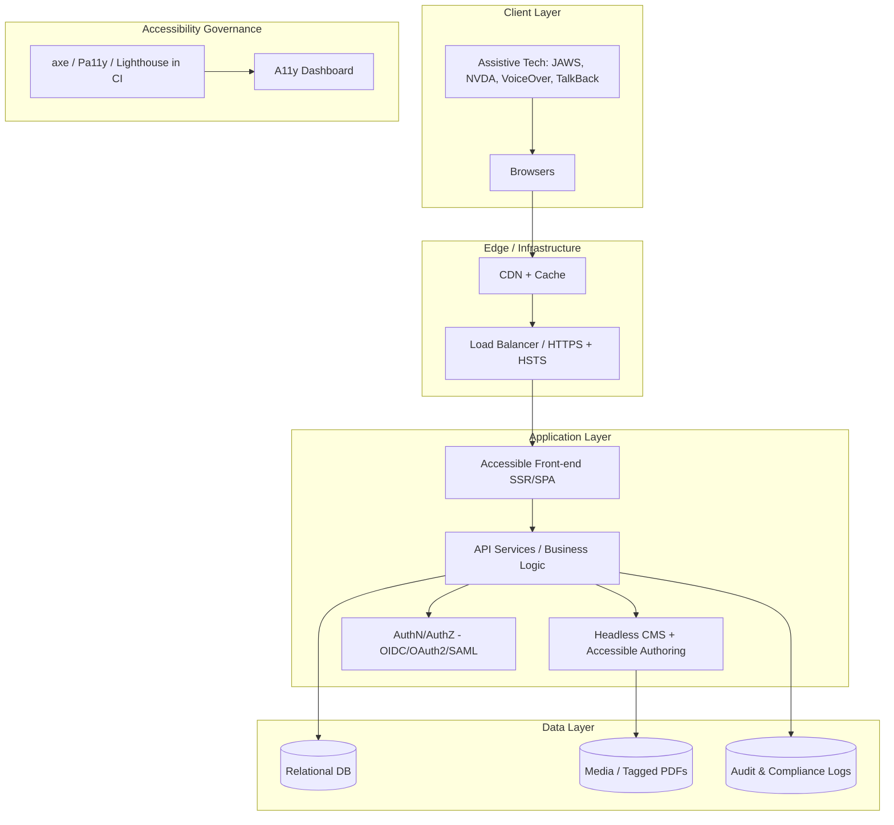
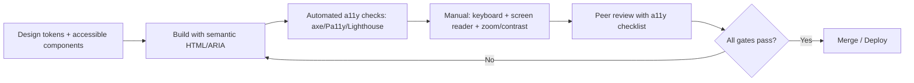

# Accessible Website — Section 508 & WCAG 2.1 AA

A production-grade reference implementation and delivery plan for a public website that is **fully operable by everyone**, including people who rely on assistive technology. The project targets **Section 508 (29 U.S.C. § 794d)** and **WCAG 2.1 Level AA** conformance across every layer — design, front-end, back-end, content, infrastructure, and governance.

> System Architect view: accessibility is treated as a **cross-cutting non-functional requirement** and a **quality gate in CI/CD**, not a post-launch audit.

---

## Table of contents

- [Goals](#goals)
- [Compliance targets](#compliance-targets)
- [Architecture at a glance](#architecture-at-a-glance)
- [Technology stack](#technology-stack)
- [Project structure](#project-structure)
- [Getting started](#getting-started)
- [Accessibility workflow](#accessibility-workflow)
- [Quality gates & Definition of Done](#quality-gates--definition-of-done)
- [Coding standards](#coding-standards)
- [Testing](#testing)
- [Agent Skill](#agent-skill)
- [Documentation index](#documentation-index)
- [Future enhancements](#future-enhancements)

---

## Goals

- Deliver a website usable by keyboard, screen reader, magnifier, and voice-input users.
- Make accessibility **measurable, automated, and enforced** in the pipeline.
- Provide an **accessible authoring experience** so content stays compliant over time.
- Ship secure code aligned with the **OWASP Top 10**.
- Keep the architecture **modular, testable, and extensible** for future needs.

## Compliance targets

| Standard | Level | Scope |
| --- | --- | --- |
| Section 508 (Revised, ICT Refresh) | Required | All public pages, documents, and authoring tools |
| WCAG 2.1 | AA | UI, content, media, PDFs/Office docs |
| OWASP Top 10 | Required | Application & API security |
| W3C HTML validation | Required | All rendered markup |

## Architecture at a glance



**Layers**

1. **Client** — browsers, assistive technologies, responsive devices.
2. **Presentation** — semantic HTML5, ARIA where needed, responsive CSS, progressive-enhancement JS.
3. **Application** — API services, business logic, CMS, authentication/authorization.
4. **Data** — relational DB, media/document storage, logs, analytics.
5. **Infrastructure** — cloud hosting, CDN, load balancer, monitoring, CI/CD.
6. **Governance** — automated checks, manual testing, compliance reporting.

## Technology stack

> Stack is illustrative and can be swapped without changing the accessibility contract.

- **Front-end:** HTML5, CSS3 (Flexbox/Grid), TypeScript, an accessible design system (e.g., [USWDS](https://designsystem.digital.gov/) or a WCAG-audited component library).
- **Back-end:** .NET / Node.js / Java (MVC + REST APIs).
- **CMS:** Headless CMS with role-based access and enforced alt text/headings/metadata.
- **Auth:** OIDC / OAuth2 / SAML, secure cookies, optional MFA.
- **Data:** SQL relational DB, object storage for tagged PDFs and captioned media.
- **Testing:** axe-core, Pa11y, Lighthouse, jest/vitest, Playwright, W3C validator.
- **CI/CD:** Git, automated lint + a11y + unit/integration tests, staging → prod promotion gated on accessibility pass.

## Project structure

```
508accesibilitystandard/
├─ README.md                      # This file
├─ Requirementdoc.md              # Consolidated requirements (functional + a11y + NFR)
├─ Implementation-Plan.md         # Phased delivery plan + task backlog
├─ Website Requirements Document.md            # Source input
├─ Technical architecture ... 508–compliant.md # Source input
└─ .github/
   └─ skills/
      └─ 508-accessibility/
         └─ SKILL.md              # Agent skill: 508/WCAG rules & checklists
```

## Getting started

1. Read [Requirementdoc.md](Requirementdoc.md) for the full scope and acceptance criteria.
2. Follow [Implementation-Plan.md](Implementation-Plan.md) for phased delivery and the task backlog.
3. Load the [Agent Skill](.github/skills/508-accessibility/SKILL.md) so tooling and reviewers apply the same accessibility rules.
4. Ensure every change satisfies the [Definition of Done](#quality-gates--definition-of-done).

## HTTPS + HSTS baseline

The backend baseline is already in place in `/backend/Program.cs`:

- `app.UseHttpsRedirection()` is enabled.
- `app.UseHsts()` is enabled for non-development environments.
- Security headers (`X-Content-Type-Options`, `X-Frame-Options`, `Referrer-Policy`, `Content-Security-Policy`) are applied to responses.

## Accessibility workflow



## Quality gates & Definition of Done

A change is **done** only when all of the following pass:

- [ ] Semantic HTML with correct landmarks and a single logical heading order.
- [ ] Fully keyboard operable; visible focus; no keyboard traps.
- [ ] Names, roles, values exposed to assistive tech (tested with NVDA/VoiceOver).
- [ ] Contrast ≥ 4.5:1 (normal text) / 3:1 (large text & UI components).
- [ ] Meaning never conveyed by color alone.
- [ ] Forms have programmatic labels, accessible errors, and text-based required indicators.
- [ ] Media has captions/transcripts; images have appropriate alt text.
- [ ] Content reflows at 400% zoom without loss of function.
- [ ] Automated a11y suite green (axe/Pa11y/Lighthouse) + no new W3C validation errors.
- [ ] OWASP-aligned input validation and output encoding for any new I/O.

## Coding standards

- **Semantics first:** prefer native HTML elements over ARIA. *"No ARIA is better than bad ARIA."*
- **Progressive enhancement:** core content and navigation work without JavaScript.
- **Separation of concerns:** presentation (CSS), behavior (JS), structure (HTML) stay decoupled.
- **Accessible by construction:** every reusable component ships with keyboard, focus, and SR support plus tests.
- **Linting enforced:** HTML/CSS/JS linters + `eslint-plugin-jsx-a11y` (or framework equivalent) run in CI.
- **Security:** server-side validation, output encoding, parameterized queries, HTTPS/HSTS, least-privilege authz.
- **Documentation:** each component documents its accessibility contract and keyboard interaction model.

## Testing

| Type | Tools | Trigger |
| --- | --- | --- |
| Automated a11y | axe-core, Pa11y, Lighthouse CI | Every PR |
| Unit / integration | jest / vitest / xUnit | Every PR |
| E2E + keyboard | Playwright | Nightly + release |
| Screen reader | JAWS, NVDA, VoiceOver | Per feature + release |
| Contrast / zoom / reflow | Manual + tooling | Per feature |
| Document a11y | PDF/Office tag & reading-order checks | On content publish |
| User acceptance | Real users incl. people with disabilities | Pre-launch |

## Agent Skill

The reusable accessibility ruleset lives at
[.github/skills/508-accessibility/SKILL.md](.github/skills/508-accessibility/SKILL.md).
It encodes the POUR principles, component checklists, and review steps so an AI agent (or engineer) applies consistent 508/WCAG guidance during design, implementation, and review.

## Future enhancements

- **Personalization:** user profiles for high-contrast, reduced-motion, font-size, and language preferences persisted server-side.
- **Automated document remediation:** pipeline that tags/validates PDFs and Office files on upload.
- **A11y telemetry:** anonymized signals for form-error rates and keyboard vs. pointer usage to prioritize fixes.
- **Design-time linting:** accessibility annotations in Figma synced to component contracts.
- **WCAG 2.2 / 3.0 readiness:** track new success criteria and extend the skill checklist.
- **Multilingual & RTL:** full internationalization with locale-aware content and layout.
- **Continuous conformance dashboard:** trend severity/resolution over time with alerting.

---

_Standards referenced: Section 508 (29 U.S.C. § 794d), WCAG 2.1 AA, Rehabilitation Act, OWASP Top 10._
